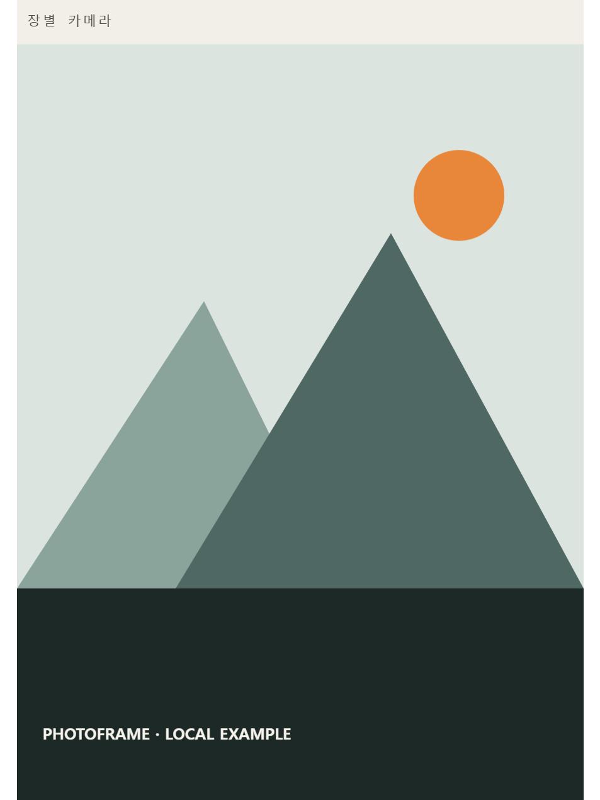

# PhotoFrame

필름·디지털·폰 사진에 프레임과 촬영 정보를 얹는 **로컬 사진 프레임 도구**.
디지털 사진은 EXIF를 자동으로 읽고, 필름이나 EXIF 없는 사진은 직접 입력합니다. 서버·계정 없이 **사진은 브라우저 밖으로 나가지 않습니다.**

**▶ 바로 쓰기: https://jim361.github.io/Photo-Frame/**

위 이미지는 이전 버전의 도형 예제를 PhotoFrame에서 실제 PNG로 내보낸 결과입니다. [프레임 안내 그림](docs/assets/readme-results.svg)과 함께, 앱에서는 직접 불러온 사진을 넣은 10종 썸네일을 비교할 수 있습니다.

## English summary

PhotoFrame is a free, privacy-first browser tool with ten frame choices, including Instax Mini, Square, and Wide-inspired borders. It preserves the photo's aspect ratio without cropping or fixing the output to physical film dimensions. Everything runs locally — no uploads, account, analytics, external fonts, install, or build. It supports per-photo metadata, configurable frame colors, appearance presets, all-photo or current-photo export with cancellation, touch zoom, local fonts, and portable project files that preserve disconnected originals without storing photo bytes.

**[Open PhotoFrame](https://jim361.github.io/Photo-Frame/)** · The interface is currently available in Korean.

## 왜 만들었나

Nikon F5로 필름 풍경 사진을 찍고 롤 단위로 인스타그램에 올리다가 만들었습니다. 현상소에서 스캔본이 돌아올 때쯤이면 **어떤 컷을 어떤 렌즈로 찍었는지 기억나지 않는** 경우가 많았습니다. 기존 도구(라이트룸 프리셋, 포토샵 액션, 유료 앱)는 매 장 텍스트를 고쳐야 하거나 사진을 서버에 올려야 했고, 무엇보다 "확실하지 않은 정보를 빼는 것"을 지원하지 않았습니다.

필름에서 출발했지만 지금은 **모든 사진**이 대상입니다 — 디지털 사진은 EXIF에서 촬영 정보를 자동으로 읽어옵니다.

- **불확실한 정보는 표시하지 않을 수 있습니다.** 렌즈가 기억나지 않으면 눈 아이콘 하나로 렌즈만 뺍니다.
- **사진 묶음이 기본 흐름입니다.** 한 번에 불러오고, 드래그나 썸네일 아래 `←` / `→` 버튼으로 순서를 정리하고, 한 번에 내보냅니다.
- **사진이 어디로도 전송되지 않습니다.** 합성은 전부 브라우저 Canvas에서 일어납니다.

자세한 배경은 [docs/CONCEPT.md](docs/CONCEPT.md).

## 주요 기능

**프레임 10종 — 현재 사진 썸네일·사진 방향 자동 대응**
- 필름 스트립: 퍼포레이션 + 엣지프린트. 세로 사진이면 필름이 세로로 지나가는 구조(퍼포레이션 좌우)로 자동 전환
- 인스탁스 미니·스퀘어·와이드: 화면 테마와 관계없이 흰색인 카드. 사진 비율을 유지하며 규격에서 따온 여백 모양만 적용하므로 자르거나 실제 필름 비율로 고정하지 않음. 기존 인스탁스는 미니로 유지하며 가로 사진은 우측 여백(가로 스택 / 세로 회전 글씨 선택), 스퀘어·와이드는 사진 방향과 관계없이 하단 여백
- 하단·상단 여백 띠, 네 변 여백이 같은 균등 매트, 넓은 하단과 중앙 정렬의 갤러리, 얇은 선을 두른 키라인, 작은 글자와 얇은 띠의 미니멀 EXIF
- 여백 프레임은 흰색 기본, 접이식 `여백 색` 패널에서 흰색/검정/아이보리 버튼·색상 선택기·HEX 입력 사용. 패널은 기본으로 접히며 열림 상태를 기억. 배경에 맞춰 글자색을 자동 결정하며 기존 여백 띠의 밝음/어두움 결과와 필름 색은 보존

**촬영 정보 — 필름과 디지털 양쪽 대응**
- 카메라 / 렌즈 / 필름·기타 / 날짜 / 설정값(조리개·셔터·ISO·초점거리) / 여러 줄 메모
- `전체 기본값`을 기준으로 현재 장 또는 체크한 여러 장만 값·표시 여부를 다르게 적용. EXIF·전역 버튼으로 항목별 복원
- 디지털 JPEG은 EXIF에서 카메라·렌즈·촬영일·설정값 **장별 자동 입력**. 읽힌 필드만 사용해 필름·디지털·폰 사진을 섞어도 서로 오염되지 않음
- 카메라·날짜만 있는 부분 EXIF와 스캐너 의심 정보는 내용을 보여 주고 명시적으로 채택. 전체 기본값에서 채택하면 현재 장·선택 장 범위로 전환해 반영된 값을 확인. 수동 입력은 유지하며 조리개·셔터·ISO·초점거리를 각각 숨기거나 날짜 표시 형식을 선택 가능
- 항목별 **눈 아이콘**으로 표시/숨김, 자주 쓰는 장비는 프리셋 팔레트에 저장
- 장비·레이아웃 프리셋은 전용 JSON으로 내보내 다른 기기에서 기존 목록과 병합 가능
- 선택 사항인 **디자인 프리셋**은 배치·글꼴·서명·로고 선택·색·표시·출력 설정을 이 브라우저에 저장. 촬영 정보·장비 팔레트·파일 제목은 제외하며 파일 글꼴·로고는 해당 로컬 리소스가 있어야 함
- 로고·서명: 이미지(투명 PNG) 또는 직접 입력한 텍스트 서명을 프레임에 각인

**레이아웃 — 프레임 스타일·세로/가로 사진별 프로파일**
- 한 줄/두 줄, 글자 크기·스타일별 정보 영역·사진 둘레 여백 %, 글꼴(모노/산세리프/세리프/필기체), 요소별 위치
- **로컬 글꼴**: 기본 시스템 글꼴, 권한을 받은 PC 설치 글꼴(데스크톱 Chrome/Edge), 직접 고른 TTF·OTF·WOFF·WOFF2 파일. 외부 폰트 요청 없음
- 인스탁스 미니·스퀘어·와이드를 포함해 스타일별 여백과 요소 위치를 분리하고, 각 스타일 안에서도 세로/가로 값을 따로 기억. 기존 인스탁스 설정·프로젝트·레이아웃 프리셋은 미니에서 그대로 사용
- **경계 표시 + 드래그 배치**: 각 요소의 실제 영역이 기본으로 표시되고(줌바 "경계"로 끄기 가능), 박스를 끌어 위치를 정합니다. 다른 요소와 수평/수직이 맞으면 가이드라인 스냅, 더블클릭으로 초기화. 정보 영역은 경계선, 인스탁스·매트 계열의 사진 둘레 여백은 사진 우상단 모서리 그립이나 `사진 둘레 여백 %` 슬라이더·숫자 입력으로 조절합니다. 요소 이동·크기·수치·프리셋·초기화는 **배치 되돌리기**로 스타일마다 최대 50단계 복원합니다
- 좁은 화면에서는 미리보기를 고정한 채 설정을 스크롤하고 두 손가락으로 확대·이동. 정밀 이동 버튼은 사진 폭의 0.1/0.5/1%씩 요소를 이동하며 기존 되돌리기에 기록

**내보내기 — 인스타 맞춤**
- 비율 맞춤: 원본 유지(기본) / 3:4 / 4:5 / 1:1 / 1.91:1 / 9:16. 예전 자동 비율 저장값은 `이전 자동 비율 (저장값)`으로 유지
- PNG/JPEG(품질), 폴더 지정 일괄 저장(Chromium). 새 작업은 긴 변 2048px과 프레임 색을 따르는 비율 패딩을 사용하며, 예전 크기·패딩색 저장값도 유지
- 처음부터 `제목(1).png, 제목(2).png…`와 제목이 없을 때의 `원본이름_framed.png` 규칙을 안내하며 입력한 제목·형식에 맞춰 갱신
- 폴더에 같은 이름이 있으면 ` (2)`, ` (3)`을 붙여 기존 파일을 보존하고 진행률·실패 결과를 표시
- 전체 또는 현재 장을 고르면 장수·예상 크기·비율·대상별 넘침을 먼저 확인하고 다음 사진부터 취소 가능. 실패한 사진은 스트립에서 골라 `현재 장만`으로 다시 내보내기
- 패딩색·긴 변 크기 조작과 선택 내보내기·실패 재시도 버튼은 제공하지 않으며, 스트립 체크박스는 촬영 정보 일괄 적용에 사용

**프로젝트 — 사진 작업 이어하기**
- 사진 순서·설정·장별 EXIF 수정값을 `.photoframe.json`으로 저장
- 프로젝트에는 사진 원본을 넣지 않으며, 다시 열 때 파일명·크기·수정 시각이 모두 맞는 원본만 자동 연결. 파일명만 같으면 차이를 보여 주고 사용자가 연결 여부를 정함
- 저장 필요/마지막 저장 상태와 미저장 이탈 경고를 제공. 브라우저 다운로드 폴백은 완료 여부를 알 수 없으므로 `다운로드 요청`으로 구분
- 일부 또는 아직 원본을 연결하지 않은 상태에서도 미연결 항목을 빠짐없이 저장. 복원 중 편집한 내용은 마지막 원본 연결 뒤에도 저장 필요 상태를 유지
- 현재 사용 중인 파일 글꼴은 프로젝트에 포함해 다른 환경에서도 복원. PC 설치 글꼴은 라이선스를 위해 파일을 복사하지 않고 이름만 저장

## 사용법

1. **열기** — 배포 페이지를 열거나, `index.html`을 내려받아 브라우저로 엽니다. 설치·빌드 불필요.
2. **사진 놓기** — JPG/PNG를 드래그하거나 클릭해서 여러 장 선택. 작업 중에는 미리보기와 같은 배경의 상단 `＋ 사진 추가`를 사용합니다.
3. **스타일 선택 + 정보 입력** — 전체 기본값을 먼저 적고, 필요한 사진은 현재 장 또는 스트립 체크박스로 골라 개별 수정. 디지털이면 EXIF가 자동으로 채워집니다.
4. **다듬기** — "표시 · 레이아웃 설정"에서 현재 스타일·사진 방향의 공통 배치를 조절하거나, 미리보기의 경계 박스·핸들을 직접 드래그. 사진 순서는 드래그 또는 썸네일 아래 작은 `←` / `→` 버튼으로 바꿉니다. 사진 삭제 취소는 제공하지 않으며, PC 원본은 그대로여서 필요하면 다시 추가할 수 있습니다.
5. **프로젝트 저장 또는 내보내기** — 나중에 이어 할 작업은 프로젝트로 저장하고, 완성본은 저장 폴더 지정(Chrome/Edge) 후 전체 또는 현재 사진의 크기·비율·넘침을 확인해 내보내기 시작.

단축키: `+`/`−` 줌, `0` 화면 맞춤, `1` 원본 크기, 사진 칩에서 `Shift+←/→` 순서 이동. 좁은 화면에서는 고정 미리보기와 핀치를 쓰고, 아래로 스크롤해 설정을 편집하거나 `↑ 미리보기로`로 돌아옵니다. 우상단 톱니바퀴의 테마는 화면만 바꾸고 사진 결과물에는 영향을 주지 않습니다.

## 프라이버시 원칙

- 사진 데이터를 외부로 보내는 코드는 **어떤 이유로도 넣지 않습니다** (analytics 포함). 외부 리소스 요청도 0건입니다 — 기본 시스템 글꼴과 사용자가 허용한 PC·파일 글꼴만 로컬에서 읽습니다.
- 브라우저에는 설정·프리셋·로컬 로고를 저장합니다. 프로젝트 파일에는 설정·촬영 정보·활성 로고·선택 파일 글꼴을 넣지만 사진 원본은 넣지 않습니다. 모두 사용자가 쓰는 로컬 환경에 남습니다.

## 브라우저 지원

| 기능 | 구현 경로 | 이번 변경에서 직접 확인 |
|---|---|---|
| 프레임 합성·PNG/JPEG | 표준 Canvas·Blob·download | 2026-09-09 Chrome 152: 10종 × 세로/가로, 실제 인코딩·원본 사진 모서리 보존. 다운로드 폴백은 이전 인앱 검증 |
| 폴더 지정 저장 | File System Access API, 없으면 다운로드 폴백 | 다운로드 폴백 |
| JPEG EXIF·자동 회전 | 자체 APP1/TIFF 파서·브라우저 디코더 | 합성 JPEG APP1/TIFF로 전체/부분/스캐너 파서 검증. 실제 기기 회전 파일 미확인 |
| PC 설치 글꼴 | `queryLocalFonts()` 또는 파일 선택 | 권한·실제 글꼴 없이 미확인 |
| 파일 글꼴 | FontFace API | 실제 폰트 파일 없이 미확인 |
| 모바일 미리보기 / 핀치 / 정밀 이동 | 고정 viewport·두 포인터·비율 이동 버튼 | Chrome 360/390/768px, 실제 포인터 핸들러 회귀 검사. 실제 터치 기기·가상 키보드 미확인 |

폴더 지정 저장과 PC 글꼴 열람은 Chromium 계열의 선택 API에 의존합니다. Firefox·Safari는 표준 기능이 있는 경로를 사용하도록 구현했지만 이번 변경에서는 실제 기기·브라우저 조합을 확인하지 않았으므로 지원을 단정하지 않습니다.
- 색 프로파일: 브라우저·OS의 이미지 디코딩과 Canvas 색 관리 차이로 원본과 색이 달라질 수 있습니다. 색이 중요한 작업은 sRGB 파일로 실제 브라우저에서 시험 내보내기를 권장합니다.

## 기술적 결정

- **단일 HTML, 의존성 0** — 내려받아 더블클릭으로 여는 사용 방식을 지키기 위해. EXIF 파서까지 직접 구현했습니다.
- **미리보기와 내보내기는 같은 합성 경로** — 둘 다 `render()`를 쓰고 경계 오버레이만 미리보기 전용입니다. 다만 화면 CSS 확대·브라우저 보간·색 관리는 저장 파일 자체와 완전히 같다고 단정하지 않습니다.
- **원본 해상도로 합성 후 축소** — 텍스트·퍼포레이션의 선명도를 지키는 순서. 브라우저 캔버스 한계를 넘는 초대형 스캔은 자동 축소 후 안내합니다.
- **모든 수치는 사진 크기 비율** — 어떤 해상도가 와도 같은 프레임, 드래그 오프셋도 비율로 저장되어 해상도 무관 동일 배치.
- **썸네일과 원본 수명 분리** — 스트립은 180px 로컬 축소본, 합성은 원본 디코드 이미지를 사용합니다. 사진 삭제 즉시 또는 프로젝트 교체 시 원본 디코드 객체를 닫습니다.
- 구조와 마이그레이션 계획: [docs/ARCHITECTURE.md](docs/ARCHITECTURE.md) · 디자인 시스템: [docs/DESIGN.md](docs/DESIGN.md) · 기능별 명세: [docs/features/](docs/features/) · 변경 이력: [CHANGELOG.md](CHANGELOG.md)

## 검증과 성능 기준

`node tools/check.mjs`는 Node 표준 라이브러리로 구문·DOM·외부 요청 코드·`legacy/` 무변경과 복구/저장/내보내기, EXIF, 핀치/정밀 이동, 색 대비/매트/디자인 제외 항목의 실제 동작을 검사합니다. 같은 검사가 GitHub Pages 배포 전에 실행됩니다.

기존 Playwright 개발 환경이 있으면 `node tools/check-browser.mjs`로 신선 저장소 초기화·콘솔 오류·외부 요청, 기존 프레임 픽셀 비교(인스탁스 흰색 변경 제외), 10종 세로/가로, 인스탁스 3종의 사진 비율 보존·프로파일·저장 호환, 색·프리셋·출력·360/390/768px 화면을 확인할 수 있습니다. 2026-09-09 Chrome 152.0.7977.83에서 이 검사와 `node tools/check.mjs`를 통과했습니다. `PLAYWRIGHT_MODULE`은 설치된 패키지 경로, `CHROME_PATH`는 로컬 Chrome 실행 파일로 지정할 수 있습니다. 앱의 런타임 의존성은 추가하지 않습니다. 스크린샷은 기본 임시 폴더 또는 `PHOTOFRAME_QA_DIR`에 기록합니다.

2026-09-07 Windows 11(10.0.26200), i5-13600KF, headless Chrome 152.0.7977.82에서 6000×4000(24MP) 합성 JPEG 약 4.4MB를 측정했습니다. 각 배치는 새 브라우저에서 1회 실행했으며 갤러리·2048px·JPEG 92 출력입니다. `node tools/benchmark-browser.mjs`로 재실행할 수 있습니다.

| 장수 | 앱 로딩 | 로딩 시작→미리보기 | 넘침 사전 검사 | 합성·JPEG 인코딩 |
|---:|---:|---:|---:|---:|
| 1 | 159ms | 292ms | 11ms | 96ms |
| 6 | 792ms | 922ms | 368ms | 392ms |
| 12 | 1,422ms | 1,542ms | 601ms | 758ms |

그라데이션·세부 무늬로 만든 합성 사진이고 EXIF는 없습니다. 저장은 메모리 모의 수신부여서 실제 폴더·다운로드 속도를 포함하지 않습니다. 반복 중앙값·실제 카메라 사진·36장 메모리·모바일 기기 성능은 측정하지 않았습니다. 측정 이후 렌더 엔진·워커·디코드 구조 최적화는 추가하지 않았습니다.

2026-09-05 Codex 인앱 Chromium, 로컬 HTTP에서 앱이 만든 953×1270 PNG(64KB)를 같은 조건으로 1/12/36장 불러온 앱 내부 단일 측정은 각각 **13ms / 119ms / 287ms**였습니다. 장당 최장 구간은 13/13/11ms였습니다. 내장 예제 가로 사진에서 카메라 입력을 5회 연속 바꾼 요청→미리보기 갱신은 **4~24ms(중앙값 7ms)**였습니다. 로딩 수치는 파일 선택 창 시간을 제외하며, 두 측정 모두 도형 예제라 실제 카메라 JPEG·PNG·EXIF 크기와 기기를 대표하지 않습니다. 실제 고해상도 36장 메모리 수치는 측정하지 않았습니다. 확인된 중복 원본 디코딩을 피하려고 스트립만 축소본으로 바꿨고 출력용 원본과 `render()`는 유지했습니다.

## 라이선스

[MIT](LICENSE)
